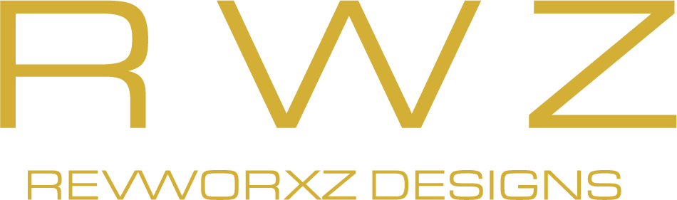

## Learn More about ReWorxZ

### I explore new forms of expression by learning from the history and traditional techniques of design . Drawing inspiration from visual culture and combining it with modern tools and technologies, I aim to discover new forms of communication.

For me, design is not just about making things look good. I work across various fields and media, from identity, illustration, UI/interactive design, 3D, animation, livery design, and even physical production. I value understanding history, culture, and how people engage with design, and carefully considering every detail to find the most suitable form for my ideas.

## Sources
- Google Fonts (googlefonts.com)
- Astro (https://astro.build/)
- Tailwind (https://tailwindcss.com/)
- Daisy UI (https://daisyui.com/)

